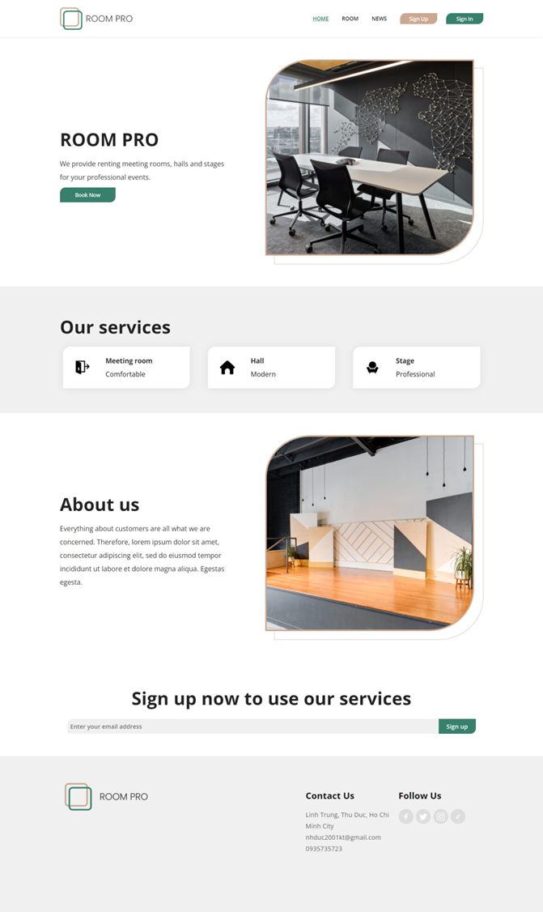
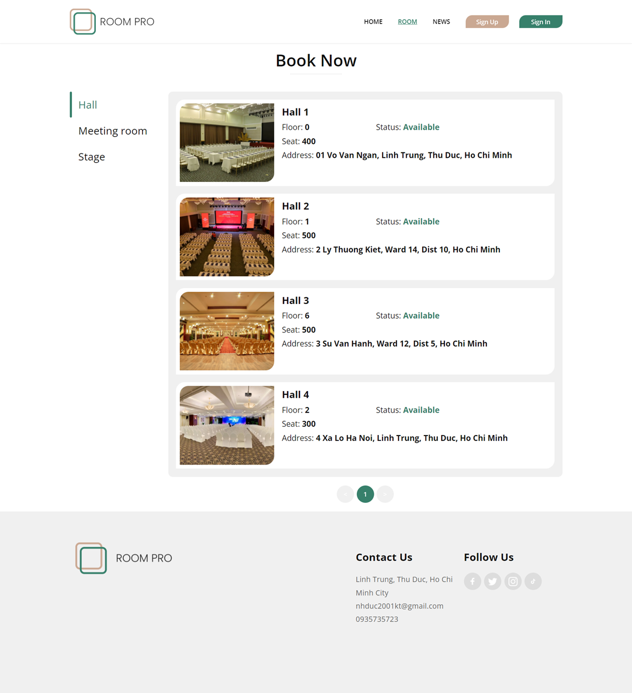
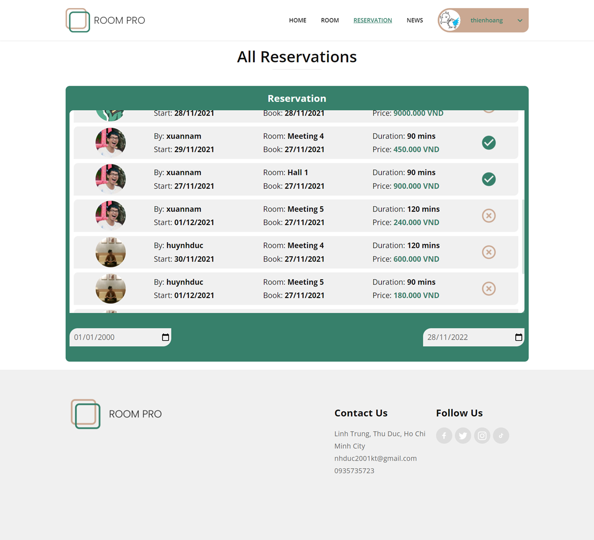

# Web Assignment - Room Renting Website

The project can be run on localhost only.

## Server side:

### Requirements:

- XAMPP 8.0.x: [download here](https://www.apachefriends.org/download.html)

### Setting up database:

- Open XAMPP control panel.

- Start Apache and MySQL.

- Run all code from `export_database.sql` in MySQL - PhpAdmin to create database.

- Change config of Apache root folder to the project folder.

- Change env variables in `.env` if needed.

## Client side:

### Requirements:

- Yarn: [download here](https://yarnpkg.com/)

- VueJS - VueCLI: [download here](https://cli.vuejs.org/guide/installation.html)

### Setting up client:

- Make sure to change working directory to `client` folder by using the command:
    ```
    $ cd client
    ```

- Install missing javascript packages:
    ```
    $ yarn install
    ```

### Running the client:

- Run the project:
    ```
    $ yarn serve
    ```

- The app is now running at local host: [http://localhost:8080/](http://localhost:8080/)


## Technologies used:

- VueJS 2.6.11

- PHP 8.0.10 (XAMPP 8.0.10)

- MySQL (MariaDB 10.4.22 - XAMPP 8.0.10)


## Some screenshots:

<p align="center">
    
</p>

<p align="center">
    
</p>

<p align="center">
    
</p>